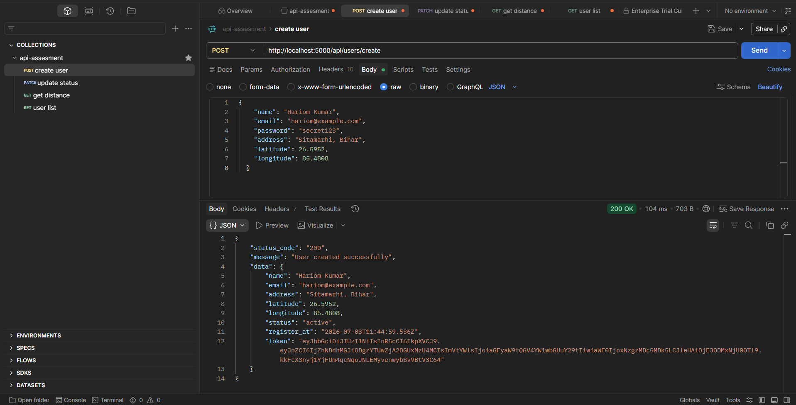
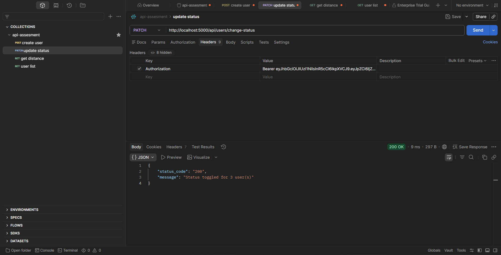
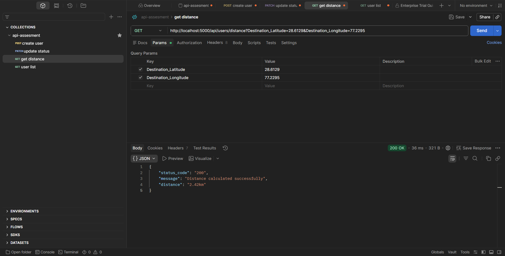
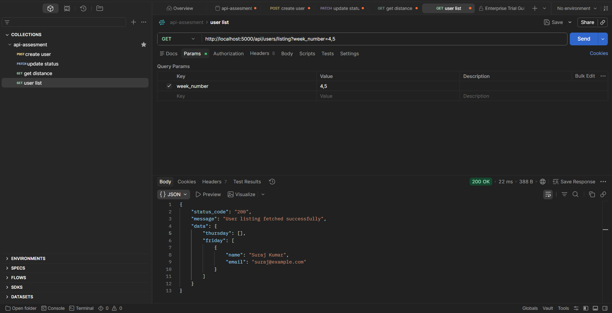

# API Assessment — Node.js + Express + MongoDB

## Setup

```bash
npm install
.env   # then fill in MONGO_URI / JWT_SECRET
nodemon  # or: npm run dev (nodemon)
```

---

### 1. Create User — `POST http://localhost:5000/api/users/create`

**Body**
```json
{
  "name": "Hariom Kumar",
  "email": "hariom@example.com",
  "password": "secret123",
  "address": "Sitamarhi, Bihar",
  "latitude": 26.5952,
  "longitude": 85.4888,
  "status": "active"
}
```
`status` is optional — defaults to `"active"` if omitted.

**Response**
```json
{
  "status_code": "200",
  "message": "User created successfully",
  "data": {
    "name": "Hariom Kumar",
    "email": "hariom@example.com",
    "address": "Sitamarhi, Bihar",
    "latitude": 26.5952,
    "longitude": 85.4888,
    "status": "active",
    "register_at": "2026-07-03T11:18:47.816Z",
    "token": "eyJhbGciOi..."
  }
}
```

Password is hashed with bcrypt before saving. `latitude`/`longitude` are also stored as a GeoJSON
`Point` (used by endpoint 3), and the registration weekday is precomputed and stored
(used by endpoint 4) — see "Design notes" below.



---

### 2. Change Users Status — `PUT http://localhost:5000/api/users/change-status`

Requires any valid token in the header. Flips **every** user's status in one shot:
active → inactive and inactive → active — with no JavaScript loop over users.

**Response**
```json
{ "status_code": "200", "message": "Status toggled for 3 users" }
```

**How it avoids loops:** it uses `updateMany` with an aggregation-pipeline update:
```js
User.updateMany({}, [
  { $set: { status: { $cond: [{ $eq: ['$status', 'active'] }, 'inactive', 'active'] } } }
]);
```
MongoDB computes the new value per document server-side in a single query.



---

### 3. Get Distance — `GET http://localhost:5000/api/users/distance?Destination_Latitude=28.6129&Destination_Longitude=77.2295`

Requires token. The caller's own current lat/long is resolved from the token
(the token encodes the user id, which is looked up server-side) and compared
against the destination point — all in a single MongoDB query, no loops.

**Response**
```json
{ "status_code": "200", "message": "Distance calculated successfully", "distance": "2.42km" }
```

**How it's a single query:** it uses the aggregation `$geoNear` stage against the
user's stored `location` (a `2dsphere`-indexed GeoJSON point), which does spherical
distance math natively in MongoDB and returns the result directly — no manual
Haversine loop in Node.



---

### 4. Get User Listing — `GET http://localhost:5000/api/users/listing?week_number=0,1`

Requires token. `week_number` is a comma-separated list of day numbers:
`0=Sunday, 1=Monday, 2=Tuesday, 3=Wednesday, 4=Thursday, 5=Friday, 6=Saturday`.

Only the requested days appear as keys in the response.

**Example — `week_number=0,1`**
```json
{
  "status_code": "200",
  "message": "User listing fetched successfully",
  "data": {
    "status_code": "200",
    "message": "User listing fetched successfully",
    "data": {
      "thursday": [],
      "friday": [{"name": "Suraj Kumar","email": "suraj@example.com"},
                  {"name": "bittu Kumar","email": "bittu@example.com"},
                  {"name": "Hariom Kumar","email": "hariom@example.com"}
                ],
      "saturday":[{"name": "pawan singh","email": "pawan@example.com"}]
  }
}
}

```

**Example — `week_number=4,5`** returns `thursday` , `friday` keys only.




## Project structure

```
api-assessment/
├── server.js               # Express app entry point
├── config/db.js            # Mongoose connection
├── models/User.js          # Schema + indexes (2dsphere, register_day, status)
├── middleware/auth.js      # JWT verification middleware
├── controllers/userController.js  # All 4 endpoint handlers
├── routes/userRoutes.js    # Route wiring
├── package.json
└── .env
```
